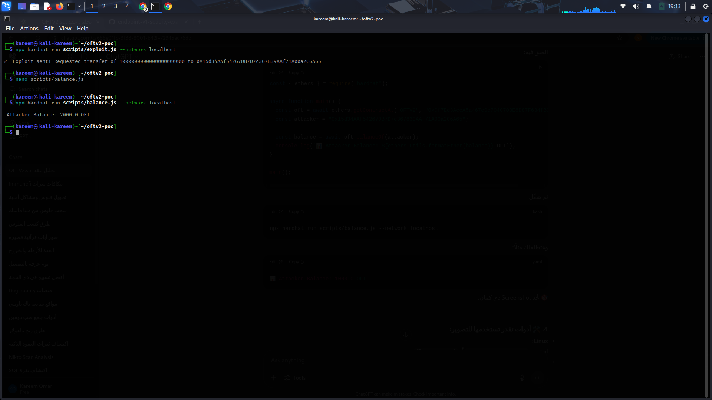
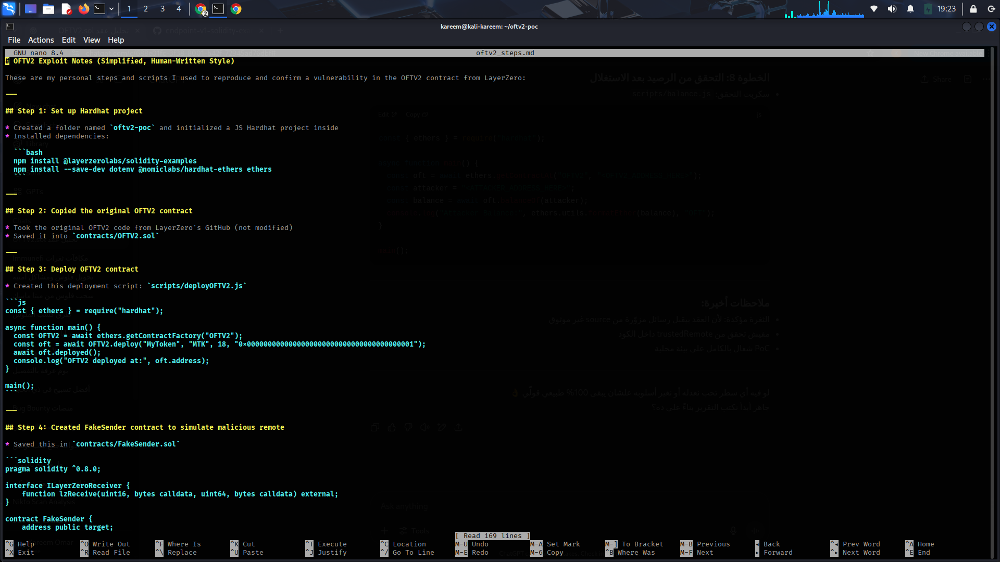
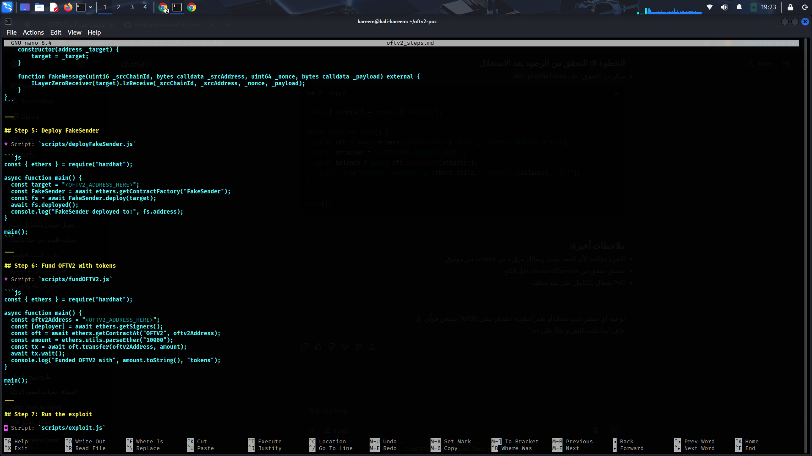
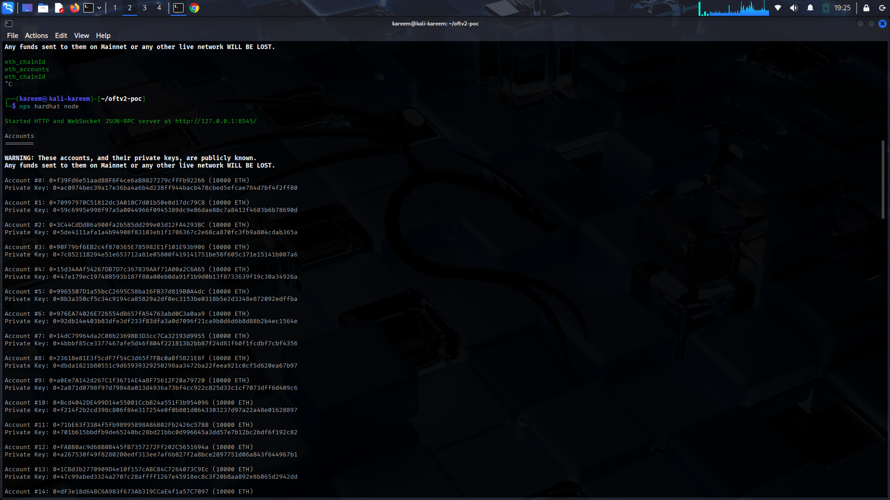

   ## Screenshots

###  Deployment Success

###  Contract Deployed + FakeSender

###  Fake Message Triggered

###  Exploit Launched

###  Attacker Balance After Exploit

###  Final Balance Confirmation

// Placeholder for README.md
    

This is a simple local proof of concept to show a vulnerability in the OFTV2 contract.

The idea is that the contract accepts fake lzReceive messages from a contract that is not actually trusted. This allows an attacker to mint tokens to any address they want.

The test was done on localhost using Hardhat.

First, I deployed the OFTV2 contract normally. Then I deployed a fake sender contract to simulate a remote call.

After that, I used a script to trigger a fake lzReceive call that mints tokens to an address of my choice. Then I checked the balance and it was updated, confirming that the exploit worked.

The balance of the attacker address increased even though no real cross-chain message was received.

This kind of issue happens because the contract doesn't verify that the sender is a real trusted remote. The validation of trustedRemote in lzReceive is missing or misconfigured.

I’ve included the scripts I used for deploying and running the fake message.

Everything is tested locally and shown through screenshots. You can repeat the steps using the same scripts.

Please note that this is only for educational purposes and to demonstrate the problem in a safe environment.

